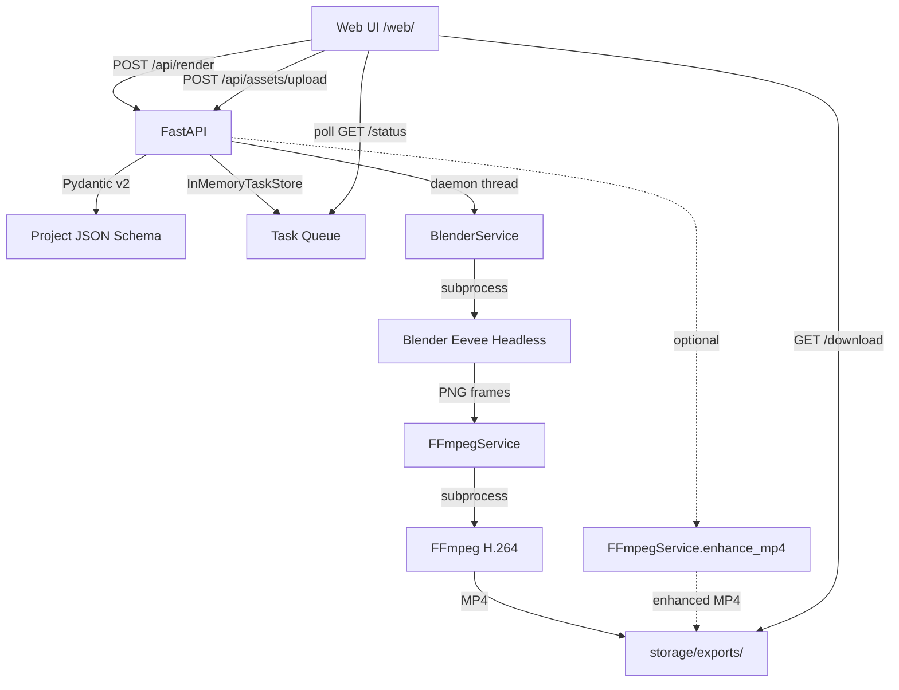

# CineAnchor Neo

Generate 8–15 second game promotion videos from PNG images or GLB models.

**Stage:** V0.1 — Loop 08 Complete (interactive camera control)

## What is CineAnchor?

CineAnchor helps mobile game and indie game operators create promotional short
videos without 3D art skills. Upload a character image or GLB model, choose a
template, type your title, and get a 1080p MP4 ready for TikTok / Xiaohongshu
/ Steam.

**Core chain:** Web → FastAPI → Project JSON → Blender Eevee → FFmpeg → MP4

## Quick Start

### 1. Prerequisites

- Windows 11 with Python 3.11+
- [Blender 5.x](https://www.blender.org/download/) (headless, Eevee engine)
- [FFmpeg](https://ffmpeg.org/download.html) (for MP4 composition)

### 2. Setup

```powershell
# Clone and enter repo
git clone https://github.com/R0xy-152/cineanchor-neo.git
cd cineanchor-neo

# Create virtual environment and install dependencies
python -m venv .venv
.\.venv\Scripts\python.exe -m pip install -r server\requirements.txt

# Configure environment (copy .env.example → .env, edit paths)
copy .env.example .env

# Verify your environment
.\.venv\Scripts\python.exe scripts\check_env.py
```

### 3. Start

```powershell
# Option A: Use the batch script
scripts\start_server.bat

# Option B: Manual
$env:BLENDER_PATH="path\to\blender.exe"
$env:FFMPEG_PATH="path\to\ffmpeg.exe"
.\.venv\Scripts\python.exe -m uvicorn server.main:app --host 127.0.0.1 --port 8000
```

### 4. Open

**http://127.0.0.1:8000/web/**

### 5. Run Tests

```powershell
scripts\run_tests.bat
# Or: .\.venv\Scripts\python.exe -m unittest discover -s tests
```

## Supported Templates

| Template | Asset | Camera | Description |
|---|---|---|---|
| character_intro | PNG (transparent) | dolly_in | Character entrance with title overlay |
| product_orbit | GLB (3D model) | dolly_in / orbit | Product showcase with tunable camera |

Camera params (`height`, `start_distance`, `end_distance`, `focal_length`) are
now wired into Blender. Both templates support configurable lighting overrides
and model transform (location / rotation / scale). See `docs/parameters.md`.

## Render Modes

| Mode | ai_enhance | Description |
|---|---|---|
| 快速版 (default) | enabled=false | Standard Blender Eevee + FFmpeg |
| 精品版 | enabled=true | Adds conservative FFmpeg eq+unsharp filter |

精品版 is a light post-processing preset. It does **not** use ComfyUI or any
AI model. If enhancement fails, the standard MP4 is returned with a warning —
the render never fails because of enhancement.

## Architecture



## API Endpoints

| Method | Path | Description |
|---|---|---|
| GET | `/health` | Health check |
| GET | `/web/` | Web UI (static) |
| POST | `/api/assets/upload` | Upload PNG or GLB |
| POST | `/api/render` | Submit Project JSON for rendering |
| GET | `/api/render/{id}/status` | Poll render status |
| GET | `/api/render/{id}/download` | Download MP4 |
| POST | `/api/keyframes` | Save recorded camera keyframes from viewport |
| GET | `/api/keyframes` | Retrieve saved viewport keyframes |

Full contract: `docs/api_contract.md`

## Storage Layout

```
storage/
├── assets/{asset_id}/           # Uploaded source files
├── projects/{task_id}/          # Generated project.json
├── renders/{task_id}/frames/    # Blender PNG frames
├── exports/{task_id}/           # final.mp4, enhanced.mp4
│   └── mass_produce/{weapon}/   # Loop 06 base videos + project.json
└── logs/{task_id}/              # blender.log, ffmpeg.log
```

All under `storage/` — gitignored.

## Error Codes

| Code | User-Facing Meaning |
|---|---|
| INVALID_PROJECT_JSON | 渲染参数无效，请检查输入 |
| ASSET_NOT_FOUND | 素材文件不存在，请重新上传 |
| UNSUPPORTED_ASSET_FORMAT | 不支持的素材格式（仅支持 PNG / GLB） |
| UNSUPPORTED_TEMPLATE | 不支持的模板 |
| BLENDER_RENDER_FAILED | 3D 渲染失败，请重试 |
| FFMPEG_COMPOSE_FAILED | 视频合成失败，请重试 |
| RENDER_TIMEOUT | 渲染超时，请稍后重试 |
| OUTPUT_NOT_READY | 视频尚未生成，请等待 |
| OUTPUT_NOT_FOUND | 输出文件缺失，请重新生成 |
| AI_ENHANCE_SKIPPED | 精品版处理失败，已返回标准版视频 |

## V0.1 Status

| Route | Result |
|---|---|
| Route 0: GLB render loop | PASS |
| Route 1: PNG 2.5D video | PASS |
| Route 2: JSON template rendering | PASS |
| Route 3: AI enhancement | PARTIAL — FFmpeg preset only, no ComfyUI |
| Route 4: Web → render chain | PASS |

See `docs/spike_results.md` for detailed spike data and `docs/portfolio_v0_1_review.md` for the full V0.1 portfolio review.

## Current Limitations

- Real-time 3D preview via interactive viewport (`apps/web/viewport.html`) — experimental
- No BGM upload
- No user accounts or project history
- No GLB decimation — large models may time out
- No automatic background removal for non-transparent PNGs
- In-memory task store (lost on server restart)
- Single-threaded rendering (one task at a time)
- Font style selection not yet wired (Blender uses default font)

## What's New

### Loop 08 — Interactive Camera Control
- Browser Three.js viewport with keyboard/mouse flight, recording with hard-cut support
- RDP + angle filter keyframe fitting, full render pipeline integration
- Interactive keyframe recording via `GET/POST /api/keyframes`
- 4 oracle tests (Three.js → Blender cross-check)
- See `AGENTS.md` for full change report

### Loop 06 — Parameter Decoupling
- Model transform (location/rotation/scale), per-light overrides, camera params
- Stage toggles: ring, glints, cloth texture, text overlay
- Mass production: 3 base videos with Seedance prompts

**154 tests** all passing.

## Development Workflow

```
/clear → 需求 → Andy 收敛需求/整理方案 → Requirements → 启明审批
→ CC 根据项目具体情况产出 plan + 验收策略 →  Andy 细化 plan + 验收策略
→ Andy plan-review gate → CC 执行 → TDD → 实现
→ git hook (单测/lint/格式/类型检查) → 视觉闸门 → parity 闸门
→ 启明验收签收 → ADR (Andy-only) → 更新文档（见下方 §文档更新策略）→ push → /clear
```

> **Andy 在 [`Andy` 分支](https://github.com/R0xy-152/cineanchor-neo/tree/Andy) 上发布需求、Requirements、Plans、ADR。** CC 从该分支读取上游文档，在自己的 `feature/*` 分支上执行。

| Role | Who | Responsibilities |
|------|-----|-----------------|
| 产品/架构 | Andy | 在 [`Andy` 分支](https://github.com/R0xy-152/cineanchor-neo/tree/Andy) 发布需求、Requirements、Plans、ADR，plan-review gate |
| 审批/验收 | 启明 | Requirements 审批，最终验收签收 |
| 执行 | CC (Claude Code) | 从 Andy 分支读取上游文档，在 `feature/*` 分支上执行：细化 plan，TDD，实现，四道闸门 |

### 文档更新策略

每个 Loop 关闭后，CC 负责更新以下文件，**保守修改、不重构结构**：

| 文件 | 更新内容 | 策略 |
|------|---------|------|
| `.claude/CLAUDE.md` | 当前阶段、关键教训、测试数 | **精简**：只放"新会话必须知道"的信息，其余指向 README / codemap。写入克制，防止上下文臃肿 |
| `README.md` | 版本号、测试数、What's New、API 表 | 修正 stale 数据，清理过时内容（如旧 loop 的 changelog），不新增 section |
| `docs/codemap.md` | 新增/删除的文件路径、测试目录 | 只追加不删除，保持目录树与实际代码一致 |
| `docs/scope.md` | 测试数、当前阶段状态 | 修正数字和状态描述，不动 In scope / Out of scope / Hard rules |
| `docs/parameters.md` | 新增 JSON 字段 | 追加新参数表，不动已有参数的描述 |
| `docs/api_contract.md` | 新增 API 端点 | 追加端点描述，不动已有端点 |
| `AGENTS.md` | Change Report | 按 AGENTS.md 自身格式写入 |

**原则：** CLAUDE.md 是给 CC 的速查卡（最小化），README 是给人看的项目概览，docs/ 是详细参考。信息不重复存放。

Before contributing, read:
- `AGENTS.md` — agent task rules, branch strategy, change report format
- `.claude/CLAUDE.md` — CC execution rules, architecture, commands
- `docs/` — scope, parameters, project JSON schema, ADRs

## Development

Read `AGENTS.md` before contributing. This project is AI-agent-first: all tasks
are designed to be executed by AI agents following the rules in AGENTS.md.

## License

[to be determined]

---
