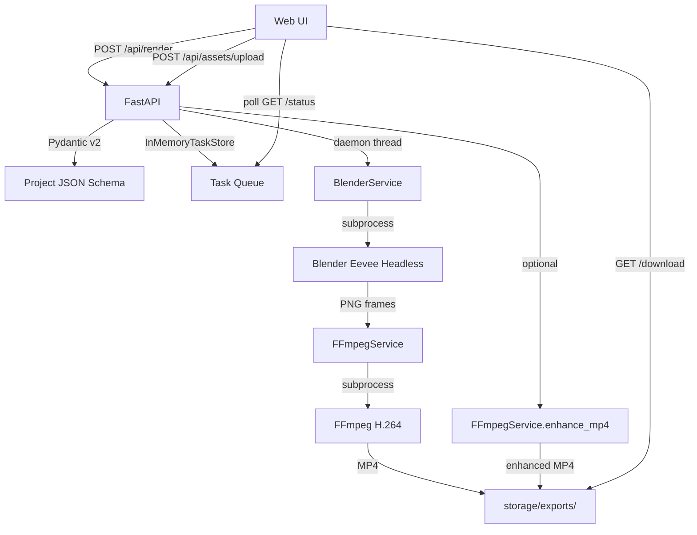

# CineAnchor V0.1 — Portfolio Review

## Product Goal

CineAnchor helps mobile game and indie game operators create 8–15 second
promotional short videos without 3D art skills. Upload a character image or
GLB model, choose a template, type your title, and get a 1080p MP4 ready for
TikTok / Xiaohongshu / Steam.

## Spike Validation (Completed 2026-06)

| Route | Goal | Result |
|---|---|---|
| Route 0 | GLB → Blender orbit → FFmpeg → MP4 | **PASS** — Blender 5.1 headless + Eevee, 8s video in ~20s |
| Route 1 | Transparent PNG → 2.5D promo video | **PASS** — PNG alpha preserved, character stays in frame |
| Route 2 | JSON-driven template rendering | **PASS** — One JSON drives camera, asset, text, duration, fps, resolution |
| Route 3 | ComfyUI AI enhancement | **PARTIAL** — Direct img2img failed (text corruption); conservative FFmpeg enhancement works but lift is mild |
| Route 4 | Web → FastAPI → Blender → MP4 | **PASS** — Full chain: upload → render → poll → download |

## V0.1 Feature Boundary

### What V0.1 Does

- Accepts formal Project JSON via `POST /api/render`
- Validates with Pydantic v2 schema
- Renders 1080p MP4 from PNG or GLB via Blender Eevee headless
- Composes H.264 video via FFmpeg (CRF 18, yuv420p)
- Serves a static Web UI at `/web/` with:
  - Template selection (character_intro, product_orbit)
  - Drag-and-drop asset upload
  - Title/subtitle/aspect ratio controls
  - Fast mode (standard) / Premium mode (mild FFmpeg enhancement)
  - Adaptive status polling with progress bar
  - Chinese error messages
  - One-click MP4 download
- Optional premium preset: conservative FFmpeg eq+unsharp filters
- 49 unittest tests covering schema, services, task queue, API, and smoke

### What V0.1 Does NOT Do

- No real-time 3D preview (Three.js)
- No BGM/audio upload
- No user accounts or database
- No project history
- No GLB decimation or automatic background removal
- No ComfyUI AI generation
- No cloud rendering or SaaS
- No Tauri/Electron desktop packaging
- No Cycles high-quality mode

## Architecture Overview



## API Flow

```
1. User uploads asset  →  POST /api/assets/upload  →  saved to storage/assets/{id}/
2. User builds params  →  POST /api/render         →  PENDING, task_id returned
3. Backend thread      →  BlenderService           →  RENDERING
4. Backend thread      →  FFmpegService            →  COMPOSITING
5. (optional)          →  FFmpegService.enhance_mp4 →  ENHANCING
6. Frontend polls      →  GET /api/render/{id}/status →  DONE / FAILED
7. Frontend downloads  →  GET /api/render/{id}/download →  MP4
```

## Render Pipeline

```
Project JSON → Blender Eevee (48 samples, GTAO, bloom, Filmic)
             → PNG frames (RGBA, 1080p)
             → FFmpeg (libx264, CRF 18, yuv420p, +faststart)
             → final.mp4 (8s, 24fps)
```

Optional premium path applies FFmpeg video filter:
```
eq=brightness=0.003:contrast=0.99:saturation=1.01:gamma=0.999,
unsharp=5:5:0.32:3:3:0.12
```

## AI Enhancement Decision

Route 3 full-frame SDXL img2img corrupted rendered subtitle text in 4/4 tested
frames. The decision: **no full-frame AI video regeneration in V0.1.**

The `conservative_premium` preset uses FFmpeg filters only (no AI model). It is
an optional quality-of-life feature, not a core selling point. ComfyUI is a
future hook; `ComfyService.is_available()` always returns False in V0.1.

## Tech Stack

| Layer | Technology |
|---|---|
| Frontend | Static HTML/CSS/JS (vanilla) |
| Backend | Python FastAPI |
| Validation | Pydantic v2 |
| 3D Render | Blender 5.1 Headless (Eevee) |
| Video | FFmpeg 8.1 (libx264) |
| Task Queue | In-memory (threading.Lock) |
| Config | Environment variables |

## Known Limitations

- In-memory task store: tasks lost on server restart
- Single-threaded render: one task at a time (daemon threads)
- No cancellation or pause for in-progress renders
- GLB models with >500K triangles may exceed render timeout
- Non-transparent PNGs render as white rectangles (no auto background removal)
- subject_scale is not supported (V0.2)
- 1:1 aspect ratio not exposed in UI (supported by backend schema)
- No upload size limit enforcement
- File format validated by extension only, not content

## What This Project Demonstrates

For portfolio or interview contexts, this project demonstrates:

1. **Full-stack integration:** Web → API → subprocess orchestration → file output
2. **Headless 3D rendering:** Blender Python API automation without GUI
3. **Schema-driven architecture:** Pydantic v2 as single source of truth
4. **Error resilience:** Structured error codes, Chinese UX messages, fallback handling
5. **Spike-first methodology:** 5 technical routes validated before committing to architecture
6. **AI safety awareness:** Documented decision NOT to use full-frame AI due to text corruption
7. **Local-first design:** No cloud dependency, no database, runs on a single Windows machine
